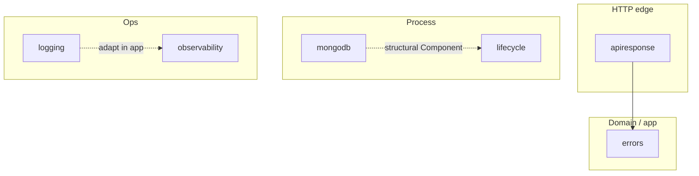

# go-pkgs

Shared Go modules for hexagonal services (TradingOps template and forks).

Each directory is an **independent module** with its own `go.mod` / `go.sum` and semver tags. There is no root module. Use `go.work` only for local multi-module development.



## Packages

| Package | Latest | Role |
|---------|--------|------|
| [errors](./errors) | `v0.4.0` | Domain errors: stable codes, opaque messages, log attrs |
| [apiresponse](./apiresponse) | `v0.1.0` | RFC 9457 Problem Details + code ↔ HTTP status |
| [logging](./logging) | `v0.2.0` | Structured logger, sinks, correlation ID |
| [observability](./observability) | `v0.3.0` | OpenTelemetry Init (traces/metrics/logs) + HTTP/gRPC helpers |
| [lifecycle](./lifecycle) | `v0.1.0` | Ordered Start / reverse Stop for process components |
| [mongodb](./mongodb) | `v0.1.0` | Connect + lifecycle `Component` over mongo-driver v2 |

**Dependencies:** `apiresponse` → `errors`. `mongodb` satisfies `lifecycle.Component` without importing it. `logging` and `observability` stay independent; wire them in the service (`internal/shared/platform`).

## Install

```bash
export GOPRIVATE=github.com/gambitier/*

go get github.com/gambitier/go-pkgs/errors@v0.4.0
go get github.com/gambitier/go-pkgs/apiresponse@v0.1.0
go get github.com/gambitier/go-pkgs/logging@v0.2.0
go get github.com/gambitier/go-pkgs/observability@v0.3.0
go get github.com/gambitier/go-pkgs/lifecycle@v0.1.0
go get github.com/gambitier/go-pkgs/mongodb@v0.1.0
```

## Versioning

Tags are per package: `errors/v0.4.0`, `lifecycle/v0.1.0`, … Cut and bump independently.

## Local development

```bash
make test    # go test in each module
make tidy    # go mod tidy in each module
make vet     # go vet in each module
make fmt     # gofmt every module
make hooks   # enable .githooks (fmt on commit)
make check   # vet + test
```

After clone, run `make hooks` once.

## Design rules

- Prefer small, focused modules over a monorepo “kit”.
- Packages that map to HTTP, logging, or OTel stay separate so services compose them.
- Domain/application code depends on `errors`; presentation depends on `apiresponse` + `logging`.
- Indexes and schema migrations stay in each service (e.g. golang-migrate), not in `mongodb`.
